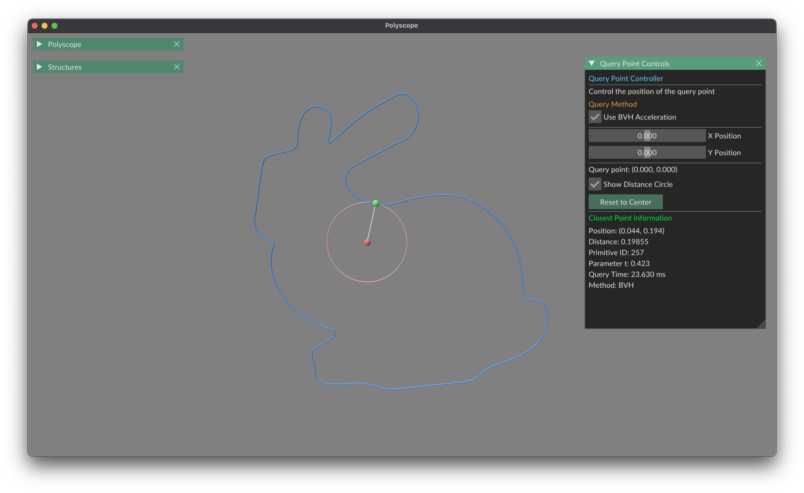
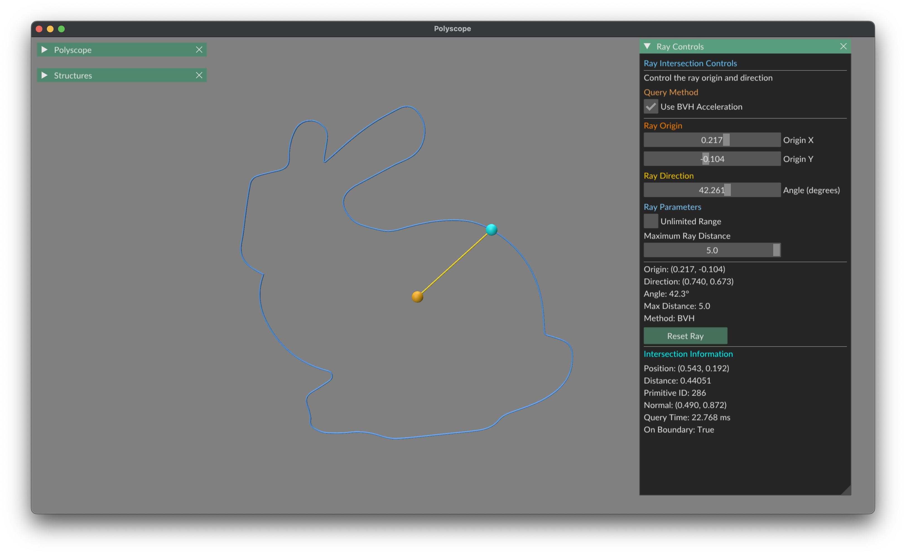
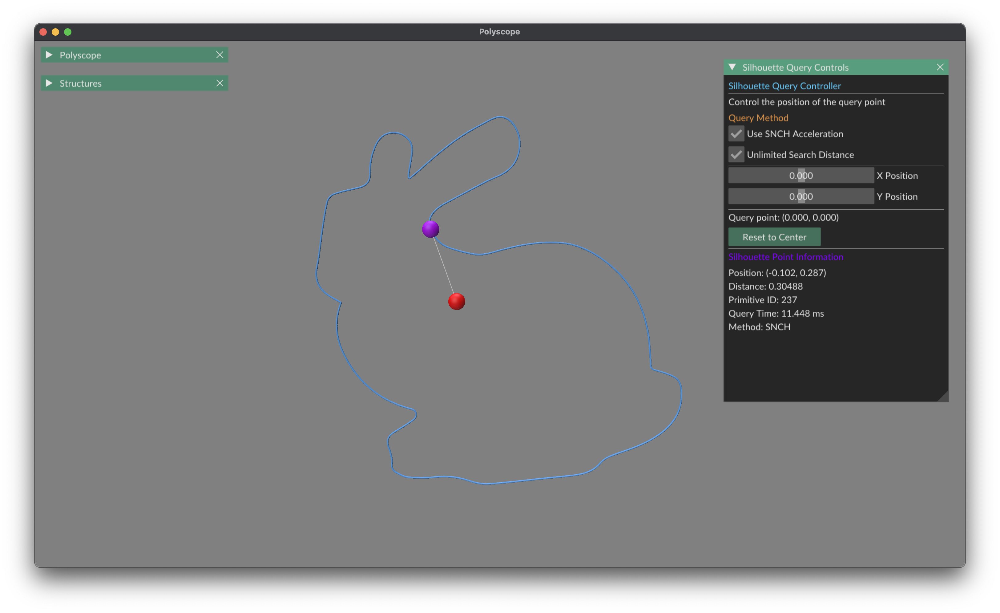
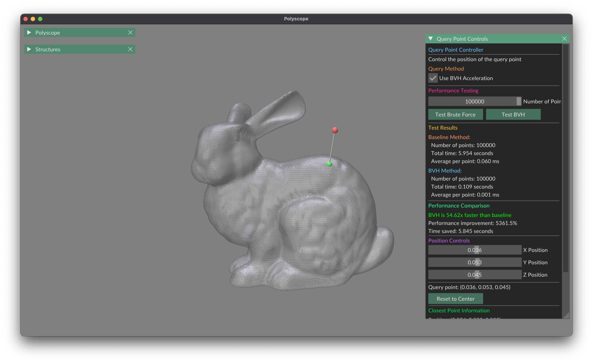
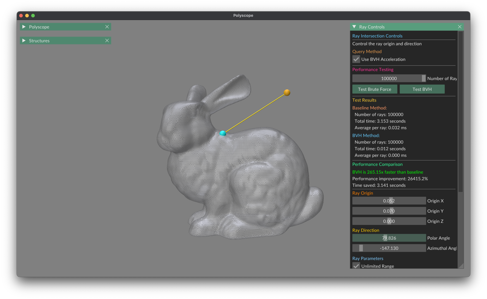
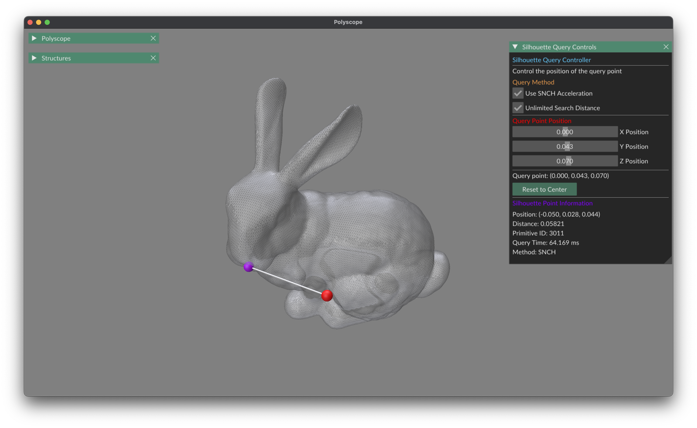

# gQuery: Fast CPU and GPU-Accelerated Geometry Queries

[](https://github.com/zihay/gquery/actions/workflows/test_build.yml)
[](https://github.com/zihay/gquery/actions/workflows/build_wheels.yml)
[](https://opensource.org/licenses/MIT)
[](https://www.python.org/)


## Overview

**gQuery** is a high-performance Python library powered by [DrJit](https://github.com/mitsuba-renderer/drjit) that delivers fast, efficient 2D and 3D geometry queries. Leveraging advanced data structures like Bounding Volume Hierarchies (BVH) and Spatialized Normal Cone Hierarchies (SNCH), it provides optimized solutions for graphics, simulation, and computational geometry applications.

The library builds acceleration structures on CPU while supporting query traversal on both CPU and GPU, utilizing DrJit's parallel computation capabilities for exceptional performance across hardware platforms.

### Supported Queries

- **👉 Closest Point Queries (2D/3D)**: Find the nearest point on geometry from any position
- **🔍 Ray Intersection Queries (2D/3D)**: Perform efficient ray-intersection tests 
- **✨ Closest Silhouette Queries (2D/3D)**: Locate closest silhouette vertices/edges from query points


## Key Features

- **🚀 High Performance**: Optimized for speed with parallel computation support
- **💻 Multi-Platform**: Run on both CPU and GPU with the same API
- **🐍 Python-API**: User-friendly Python interface with minimal overhead

## Demo

Below are visual demonstrations of gQuery's capabilities. All demo code can be found in the `demo` folder of the repository. You can run these demos directly using Python after installing gQuery.

### 2D Closest Point Queries

<div align="center">
    
    <p><i>Finding the nearest point on 2D shapes from query points.</i></p>
</div>

### 2D Ray Intersection Queries

<div align="center">
    
    <p><i>Detecting intersections between rays and 2D geometries.</i></p>
</div>

### 2D Closest Silhouette Queries

<div align="center">
    
    <p><i>Finding the closest silhouette vertices from a given query point in 2D.</i></p>
</div>

### 3D Closest Point Queries

<div align="center">
    
    <p><i>Finding the closest point on a 3D mesh from any query point.</i></p>
</div>

### 3D Ray Intersection Queries

<div align="center">
    
    <p><i>Detecting intersections between rays and 3D geometry.</i></p>
</div>

### 3D Closest Silhouette Queries

<div align="center">
    
    <p><i>Finding the closest silhouette edges from a given query point in 3D.</i></p>
</div>

## Installation

### Install from Source

For the latest development version:

```bash
# Clone the repository
git clone https://github.com/zihay/gquery.git
cd gquery

# Install in development mode
pip install -e .

# Or install the latest main branch directly
pip install git+https://github.com/zihay/gquery.git
```


## Usage Examples
### Working with 2D Polylines

```python
import numpy as np
import drjit as dr
from gquery.core.fwd import Float, Array2, Array2i
from gquery.shapes.polyline import Polyline

# Create a 2D polyline (a simple pentagon)
vertices = np.array([
    [0.0, 0.0],
    [1.0, 0.0],
    [1.5, 1.0],
    [0.5, 1.5],
    [-0.5, 1.0]
])
edges = np.array([
    [0, 1],
    [1, 2],
    [2, 3],
    [3, 4],
    [4, 0]
])

# Create a polyline
polyline = Polyline(Array2(vertices.T), Array2i(edges.T))

# Perform closest point query
# DrJit array for batch processing
query_point = Array2(np.array([[0.8, 0.8]]).T)

closest = polyline.closest_point_bvh(query_point)

# Extract results
print('📍 Closest Point Query:')
print(f'  Query point: {query_point}')
print(f'  Closest point: {closest.p}')
print(f'  Distance: {closest.d}')


# Perform ray intersection query
direction = Array2(np.array([[1.0, 1.0]]).T)
r_max = Float(dr.inf)
intersection = polyline.intersect_bvh(query_point, direction, r_max)

print('📌 Ray Intersection:')
print(f'  Origin: {query_point}')
print(f'  Direction: {direction}')
print(f'  Intersection Point: {intersection.p}')
print(f'  Intersection Distance: {intersection.d}')


# Perform silhouette query
query_point = Array2(np.array([[2., 0.5]]).T)
silhouette = polyline.closest_silhouette_snch(query_point)

print('📍 Silhouette Query:')
print(f'  Query point: {query_point}')
print(f'  Silhouette point: {silhouette.p}')
print(f'  Distance: {silhouette.d}')
```

### Working with 3D Meshes

```python
import numpy as np
import drjit as dr
from gquery.core.fwd import Float, Array3, Array3i
from gquery.shapes.mesh import Mesh

# Create a 3D mesh (a simple tetrahedron)
vertices = np.array([
    [0.0, 0.0, 0.0],   # 0
    [1.0, 0.0, 0.0],   # 1
    [0.5, 1.0, 0.0],   # 2
    [0.5, 0.5, 1.0]    # 3
])

# Define faces for the tetrahedron (triangles)
faces = np.array([
    [0, 1, 2],  # bottom face
    [0, 1, 3],  # side face 1
    [1, 2, 3],  # side face 2
    [0, 2, 3]   # side face 3
])

# Create a mesh
mesh = Mesh(Array3(vertices.T), Array3i(faces.T))

# Perform closest point query
# DrJit array for batch processing
query_point = Array3(np.array([[0.6, 0.6, 0.6]]).T)

closest = mesh.closest_point_bvh(query_point)

# Extract results
print('📍 Closest Point Query:')
print(f'  Query point: {query_point}')
print(f'  Closest point: {closest.p}')
print(f'  Distance: {closest.d}')


# Perform ray intersection query
direction = Array3(np.array([[1.0, 1.0, 1.0]]).T)
r_max = Float(dr.inf)
intersection = mesh.intersect_bvh(query_point, direction, r_max)

print('\n📌 Ray Intersection:')
print(f'  Origin: {query_point}')
print(f'  Direction: {direction}')
print(f'  Intersection Point: {intersection.p}')
print(f'  Intersection Distance: {intersection.d}')


# Perform silhouette query
query_point = Array3(np.array([[1.5, 0.5, 0.5]]).T)
silhouette = mesh.closest_silhouette_snch(query_point)

print('\n📍 Silhouette Query:')
print(f'  Query point: {query_point}')
print(f'  Silhouette point: {silhouette.p}')
print(f'  Distance: {silhouette.d}')
```

## Performance Tips

- 🔥 Use batch queries whenever possible for maximum performance

## Requirements

- Python 3.8 or newer
- CUDA-compatible GPU (optional, for GPU acceleration)
- CUDA Toolkit 11.0 or newer (for GPU execution)

## Citing

If you use gQuery in your research, please consider citing:

```bibtex
@software{gQuery,
  author = {Zihan Yu},
  title = {gQuery: Fast CPU and GPU-Accelerated Geometry Queries},
  month = {April},
  year = {2025},
  url = {https://github.com/zihay/gquery}
}
```

## License

gQuery is distributed under the MIT license. See the [LICENSE](LICENSE) file for details.
## Acknowledgements

This project was built upon and inspired by these remarkable open-source libraries:
- [DrJit](https://github.com/mitsuba-renderer/drjit) - High-performance differentiable ray tracing framework
- [pbrt-v4](https://github.com/mmp/pbrt-v4) - Physically Based Rendering implementation
- [FCPW](https://github.com/rohan-sawhney/fcpw) - Fast closest point and spatial queries
- [Polyscope](https://polyscope.run/) - UI for 3D data visualization

